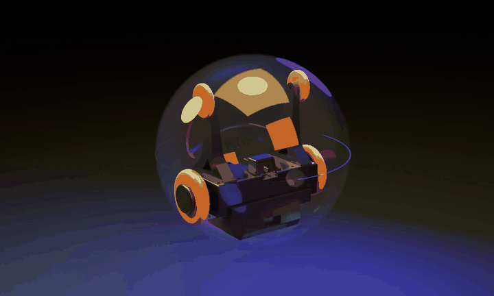

# ESP32 足球机器人 All-in-One 控制台



这是一个面向小型足球机器人/小球车的完整实验项目：电脑运行一个 Python WebUI，同时管理小车电机、IMU 姿态、两路摄像头、YOLO/YOLOE 识别、实体摇杆、语音控制，以及无人机俯拍视角下的 `football` 到 `football gate` 自动路径控制。

主入口是 `all_in_one_webui.py`。它会把网页控制、摄像头接收、YOLOE 推理、实体遥控器代理、IMU 可视化和语音方向控制整合在一个页面里。

## 能做什么

- 控制双电机小车：PWM 调试、差速摇杆、前进/后退/转向/停止。
- 读取编码器、RPM、IMU 姿态，并在网页里显示 3D 姿态。
- 接收小车摄像头画面和独立 YOLO 摄像头画面。
- 用 YOLO/YOLOE 识别 `football`、`football gate` 等目标。
- 将 YOLO 识别框中心点做匹配，计算小球相对球门应前进、后退、向左或向右的连续路径。
- 通过已有 `/drive?throttle=&steering=` 接口把路径指令连续发送给小车，不需要修改 stick 或小车固件协议。
- 支持实体摇杆遥控器，并可在 WebUI 中开启/关闭小车转发。
- 支持 XIAO ESP32S3 Sense 板载麦克风语音方向控制，语音识别走 DashScope Realtime ASR。
- 可选 Android 控制器工程，用手机直接控制 ESP32 小车。

## 目录结构

```text
.
├── all_in_one_webui.py                         # 推荐主入口：三合一/多合一 WebUI
├── voice_drive_realtime.py                     # 语音识别 sidecar，接收 ESP32 麦克风 PCM
├── voice_requirements.txt                      # 语音 sidecar 依赖
├── .env.example                                # 本地环境变量示例，不含真实密钥
├── esp32/
│   └── esp32_motor_control/
│       └── esp32_motor_control.ino             # 小车电机、编码器、IMU、摄像头固件
├── physical_remote/
│   ├── esp32_joystick_remote/
│   │   └── esp32_joystick_remote.ino           # 实体摇杆遥控器固件
│   └── README.md                               # 遥控器单独说明
├── esp32_camera_yolo8_project/
│   ├── esp32_camera_stream/
│   │   └── esp32_camera_stream.ino             # 独立 YOLO 摄像头固件
│   ├── app_camera_yolo.py                      # 早期独立 YOLO WebUI
│   ├── requirements.txt                        # YOLO 依赖
│   └── README.md                               # 独立 YOLO 摄像头说明
└── android-controller/                         # 可选 Android 原生控制器
```

`app.py`、`app_all_in_one.py`、`physical_remote/app_remote.py`、`esp32_camera_yolo8_project/app_camera_yolo.py` 是早期拆分入口，推荐日常使用 `all_in_one_webui.py`。

## 硬件清单

核心小车：

- Seeed Studio XIAO ESP32S3 或 XIAO ESP32S3 Sense。
- 两个带编码器直流电机。
- 两块 DRV8871 直流电机驱动板。
- 外部电机电源，例如 12V 电池或电源模块。
- BNO080/BNO085 IMU 模块。
- 可选：XIAO ESP32S3 Sense 摄像头，用作小车第一视角。

实体摇杆遥控器：

- 第二块 XIAO ESP32S3 / XIAO ESP32S3 Sense。
- 摇杆模块，带 `VRx`、`VRy`、`SW`。
- 可选：Sense 版本板载 PDM 麦克风，用于语音方向控制。

YOLO/无人机俯拍摄像头：

- 第三块 XIAO ESP32S3 Sense 摄像头，或其他能运行项目摄像头固件的 ESP32 摄像头板。
- 也可以把这块摄像头固定在无人机、云台或球场上方支架上，拍摄整个球场。

电脑端：

- macOS / Windows / Linux 均可。
- Python 3.9+。
- 如果要跑 YOLOE，建议有性能较好的 CPU/GPU；没有 GPU 也可以先低帧率测试。

### 材料表（采购参考）

| 类别 | 用途 | 参考链接 | 建议数量 |
| --- | --- | --- | --- |
| 透明外壳 | 小车外壳/结构固定 | [淘宝链接](https://item.taobao.com/item.htm?id=772958364919) | 1 套 |
| 12V 直流电机 | 小车左右驱动轮 | [淘宝链接](https://item.taobao.com/item.htm?id=998689917562) | 2 个 |
| 12V 锂电池 | 电机主电源 | [淘宝链接](https://item.taobao.com/item.htm?id=632184698346) | 1 块 |
| ESP32 开发板 | 小车主控、遥控器、摄像头节点 | [淘宝链接](https://item.taobao.com/item.htm?id=796226570709) | 2-3 块 |
| 电机驱动板 | 驱动 12V 直流电机 | [天猫链接](https://detail.tmall.com/item.htm?id=755246866317) | 2 块 |
| 12V 转 5V 降压模块 | 从电池给 ESP32/外设供电 | [淘宝链接](https://item.taobao.com/item.htm?id=547992411877) | 1 个 |
| 九轴 IMU | 姿态检测、航向纠偏 | [淘宝链接](https://item.taobao.com/item.htm?id=731960643704) | 1 个 |

> 这些链接是采购参考。公开 README 中只保留商品链接，不包含账号、订单或个人信息。

## 安全注意

公开上传 GitHub 前不要提交真实 Wi-Fi 密码、API Key、`.env.local`、模型权重、Android `local.properties` 或构建产物。

本仓库已经把示例固件里的 Wi-Fi 改成占位符：


```cpp
const char* WIFI_SSID = "YOUR_WIFI_SSID";
const char* WIFI_PASSWORD = "YOUR_WIFI_PASSWORD";
```

你需要在本地烧录前改成自己的 Wi-Fi。不要把改过真实密码的版本提交到公开仓库。

## 第一步：准备 Python 环境

在项目根目录创建虚拟环境：

```bash
python3 -m venv .venv
source .venv/bin/activate
python -m pip install --upgrade pip
```

安装 All-in-One 所需依赖：

```bash
pip install ultralytics opencv-python numpy websockets
```

如果只运行基础小车控制，不启用 YOLO 和语音，可以先不装 `ultralytics` 和 `websockets`，但完整功能建议一次装好。

## 第二步：配置本地环境变量

复制示例配置：

```bash
cp .env.example .env.local
```

编辑 `.env.local`：

```env
DASHSCOPE_API_KEY=your_dashscope_api_key_here
PUBLIC_IP=192.168.1.100
ESP32_BASE_URL=http://192.168.1.11
ROBOT_ESP32_URL=http://192.168.1.11
REMOTE_ESP32_URL=http://192.168.1.60
YOLO_CAMERA_ALLOWED_IP=192.168.1.71
ROBOT_CAMERA_ALLOWED_IP=192.168.1.11
TARGET_CLASSES=football, football gate
```

说明：

- `PUBLIC_IP` 是运行 Python WebUI 的电脑 IP，ESP32 摄像头会连到这台电脑。
- `ESP32_BASE_URL` / `ROBOT_ESP32_URL` 是小车 ESP32 的地址。
- `REMOTE_ESP32_URL` 是实体摇杆 ESP32 的地址。
- `YOLO_CAMERA_ALLOWED_IP` 是独立 YOLO 摄像头 ESP32 的地址。
- `DASHSCOPE_API_KEY` 只用于语音识别；不用语音可以留空。

`.env.local` 已在 `.gitignore` 中忽略。

## 第三步：小车硬件接线

### 编码器

电机 1：

| 电机编码器线 | XIAO ESP32S3 |
| --- | --- |
| 编码器 VCC | `3V3` |
| 编码器 GND | `GND` |
| A 相 | `D0 / GPIO1` |
| B 相 | `D1 / GPIO2` |

电机 2：

| 电机编码器线 | XIAO ESP32S3 |
| --- | --- |
| 编码器 VCC | `3V3` |
| 编码器 GND | `GND` |
| A 相 | `D4 / GPIO5` |
| B 相 | `D5 / GPIO6` |

### DRV8871 电机驱动

电机 1：

| DRV8871 | XIAO ESP32S3 |
| --- | --- |
| `IN1` | `D2 / GPIO3` |
| `IN2` | `D3 / GPIO4` |
| `GND` | `GND` |

电机 2：

| DRV8871 | XIAO ESP32S3 |
| --- | --- |
| `IN1` | `D9 / GPIO8` |
| `IN2` | `D10 / GPIO9` |
| `GND` | `GND` |

两个 DRV8871 的 `POWER+ / POWER-` 接外部电机电源。ESP32、驱动板、电机电源必须共地。不要用 ESP32 的 `3V3/5V` 直接给电机供电。

### BNO080/BNO085 IMU

| IMU | XIAO ESP32S3 |
| --- | --- |
| `VIN` / `3V3` | `3V3` |
| `GND` | `GND` |
| `SDA` | `D6 / GPIO43` |
| `SCL` | `D7 / GPIO44` |

## 第四步：烧录小车固件

1. 用 Arduino IDE 打开 `esp32/esp32_motor_control/esp32_motor_control.ino`。
2. 安装开发板包：`esp32`。
3. 安装库：`ArduinoWebsockets`、`SparkFun BNO080 Arduino Library`。
4. 开发板选择 `Seeed XIAO ESP32S3`。
5. 修改顶部配置：

```cpp
const char* WIFI_SSID = "你的WiFi名称";
const char* WIFI_PASSWORD = "你的WiFi密码";
const char* PYTHON_SERVER_IP = "运行 all_in_one_webui.py 的电脑 IP";
```

6. 上传固件，打开串口监视器，记录小车 IP。
7. 把 `.env.local` 里的 `ESP32_BASE_URL` / `ROBOT_ESP32_URL` 改成小车 IP。

## 第五步：烧录实体摇杆固件

摇杆接线：

| 摇杆模块 | XIAO ESP32S3 |
| --- | --- |
| `GND` | `GND` |
| `+5V` | `3.3V-OUT` |
| `VRx` | `D10 / GPIO9` |
| `VRy` | `D9 / GPIO8` |
| `SW` | `D8 / GPIO7` |

烧录步骤：

1. 打开 `physical_remote/esp32_joystick_remote/esp32_joystick_remote.ino`。
2. 修改 `WIFI_SSID`、`WIFI_PASSWORD`、`ROBOT_ESP32_IP`、`VOICE_SERVER_HOST`。
3. 上电时保持摇杆居中，固件会自动校准中心。
4. 串口监视器里记录遥控器 IP。
5. 把 `.env.local` 的 `REMOTE_ESP32_URL` 改成遥控器 IP。

WebUI 中可以开启“实体遥控器小车转发”。开启后网页摇杆会被锁定，避免两个控制源同时发指令。

## 第六步：烧录独立 YOLO 摄像头

1. 打开 `esp32_camera_yolo8_project/esp32_camera_stream/esp32_camera_stream.ino`。
2. 修改：

```cpp
const char* WIFI_SSID = "你的WiFi名称";
const char* WIFI_PASSWORD = "你的WiFi密码";
const char* CAMERA_WS_HOST = "运行 all_in_one_webui.py 的电脑 IP";
```

3. 上传固件。
4. 串口监视器里记录摄像头 IP。
5. 把 `.env.local` 的 `YOLO_CAMERA_ALLOWED_IP` 改成该 IP。

这块摄像头会连接：

```text
ws://电脑IP:8081/ws/camera
```

如果它挂在无人机上，建议先固定在高处测试，确认能稳定拍完整球场，再上无人机飞行测试。

## 第七步：启动 All-in-One WebUI

在项目根目录运行：

```bash
source .venv/bin/activate
python all_in_one_webui.py
```

浏览器打开：

```text
http://127.0.0.1:8000
```

局域网其他设备访问：

```text
http://你的电脑IP:8000
```

页面包含：

- 小车控制。
- 语音摇杆控制状态。
- IMU 闭环辅助参数。
- 小车摄像头和 YOLOE 识别摄像头。
- 无人机追球路径。
- IMU 3D 姿态。
- 实体摇杆遥控器孪生。

## 第八步：使用 YOLO 自动路径

1. 保证独立 YOLO 摄像头画面能在 WebUI 中显示。
2. 在“检测类型”输入：

```text
football, football gate
```

3. 点击“应用检测类型”。
4. 等待画面里出现小球和球门框。
5. 在“无人机追球路径”区域点击“开启自动路径”。

系统会做这些事：

- 从 YOLO 检测结果里筛选 `football` 和 `football gate`。
- 计算两个框中心点。
- 多个球或多个球门同时出现时，选择中心距离最近的一对。
- 根据中心点向量计算 `throttle` 和 `steering`。
- 连续调用小车已有 `/drive?throttle=&steering=` 接口。
- 识别超时、到达球门中心或关闭自动路径时停车。

常用环境变量：

| 变量 | 默认值 | 说明 |
| --- | --- | --- |
| `AUTO_PATH_ENABLED` | `0` | 启动时是否自动开启路径控制 |
| `AUTO_PATH_BALL_CLASSES` | `football, sports ball, ball` | 识别为球的类别 |
| `AUTO_PATH_GATE_CLASSES` | `football gate, gate, goal` | 识别为球门的类别 |
| `AUTO_PATH_INTERVAL_MS` | `160` | 自动发送路径指令间隔 |
| `AUTO_PATH_STALE_MS` | `900` | 检测结果超时停车时间 |
| `AUTO_PATH_MIN_SPEED` | `18` | 最小速度 |
| `AUTO_PATH_MAX_SPEED` | `65` | 最大速度 |
| `AUTO_PATH_STEERING_LIMIT` | `80` | 转向限幅 |
| `AUTO_PATH_DEADZONE_RATIO` | `0.04` | 中心点死区，占画面对角线比例 |
| `AUTO_PATH_ARRIVAL_RATIO` | `0.06` | 认为到达的距离，占画面对角线比例 |

## 语音控制

语音链路是：

```text
实体摇杆 ESP32 麦克风 -> voice_drive_realtime.py -> DashScope Realtime ASR -> all_in_one_webui.py -> 小车 /drive
```

启动前设置 `.env.local` 中的 `DASHSCOPE_API_KEY`，然后运行：

```bash
python all_in_one_webui.py
```

`all_in_one_webui.py` 默认会内置启动语音 sidecar。识别到“前进、后退、向左、向右、停止、左前、右后”等方向词后，会转换成小车摇杆向量。

## Android 控制器

`android-controller/` 是可选原生 Android 工程。用 Android Studio 打开该目录，等待 Gradle 同步后运行到手机。

它适合手机和 ESP32 在同一热点或局域网下直连，不依赖 Python WebUI。首次构建会自动生成 `android-controller/build/`、`android-controller/app/build/` 和 `android-controller/local.properties`，这些都不应该提交。

## 常见问题

### YOLO 首次运行很慢

首次运行可能会下载模型权重。模型文件如 `*.pt` 已被 `.gitignore` 忽略，不建议上传 GitHub。

### WebUI 看不到摄像头

检查三点：

1. ESP32 摄像头串口里是否显示已连接 WebSocket。
2. `CAMERA_WS_HOST` 是否是电脑局域网 IP，而不是 `127.0.0.1`。
3. `.env.local` 里的 `YOLO_CAMERA_ALLOWED_IP` / `ROBOT_CAMERA_ALLOWED_IP` 是否和设备实际 IP 一致。

### 小车不动

检查：

1. ESP32 串口是否打印了正确 IP。
2. 浏览器打开 `http://小车IP/status` 是否有 JSON 返回。
3. 电机电源是否单独供电。
4. ESP32、DRV8871、电机电源是否共地。
5. WebUI 里是否开启了实体遥控器转发或自动路径，导致网页手动控制被锁定。

### 自动路径方向反了

无人机/摄像头安装方向会影响画面坐标。先把摄像头固定，观察画面箭头和小车实际方向。如果左右相反，可以先在机械安装上旋转摄像头或调整小车前进方向；后续也可以在 WebUI 层增加方向镜像参数。

## API 简表

All-in-One WebUI：

- `GET /`：主页面。
- `GET /api/status`：代理小车状态。
- `GET /api/imu-state`：IMU 状态。
- `GET /api/camera-state`：小车摄像头状态。
- `GET /api/yolo-camera-state`：YOLO 摄像头状态。
- `GET /api/yolo-state`：YOLO 检测状态。
- `GET /api/auto-path-state`：自动路径状态。
- `POST /api/auto-path-config`：开启/关闭自动路径或调整参数。
- `POST /api/yolo-config`：更新检测类别。
- `POST /api/voice-drive`：语音方向命令入口。
- `POST /imu`：小车 ESP32 上报 IMU JSON。

小车 ESP32：

- `GET /status`
- `POST /drive?throttle=0&steering=0`
- `POST /pwm?motor=1&value=50`
- `POST /stop`
- `POST /config?...`

实体摇杆 ESP32：

- `GET /status`
- `POST /stop`
- `POST /recalibrate`
- `POST /forward?enabled=1`
- `POST /orientation?rotate=90`
- `POST /mode?assistMode=2`

## GitHub 发布前检查清单

- `.env.local` 不存在或未被提交。
- 固件里没有真实 `WIFI_SSID` / `WIFI_PASSWORD`。
- 没有提交 `*.pt`、`*.onnx`、`*.engine` 模型权重。
- 没有提交 Android `build/`、`.gradle/`、`local.properties`。
- 没有提交 `__pycache__/`、`.venv/`、`.DS_Store`。
- README 中只保留示例 IP 和占位密钥。

